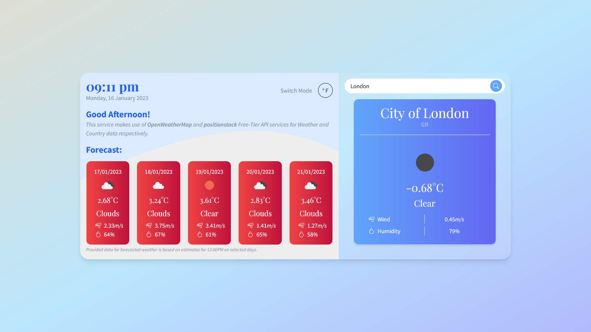

# Weather API - ReactJS App

Currently the first ReactJS project I've got invested in, rather than doing little learning exercises. I wanted to push on what I've learnt and put those skills to work in order to improve upon them. 

Started of by asking ChatGPT for some criteria to meet for Weather App, without giving any examples, and then attempted to meet each criteria for functionality. The only point I didn't complete was adding User Authentication to enable saving specific Locations, but since I've done a couple versions of this in other projects, decided against adding it. 

Currently looking for feedback on my ReactJS code, so I'm more than happy to hear any tips!

[View Page](https://react-weather-app.fly.dev/)

## Preview
